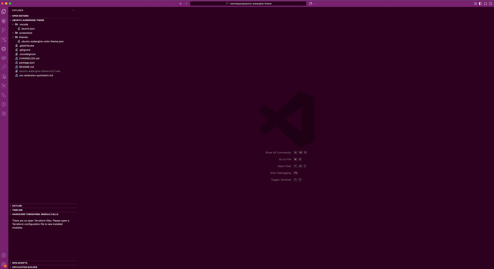

# Ubuntu Aubergine Theme for Cursor/VSCode

A dark theme inspired by Ubuntu's iconic aubergine and orange palette.

## Features
- Ubuntu Human color scheme for UI
- Syntax highlighting tuned with orange, aubergine, and complementary tones
- Consistent look across editor, panels, inputs, and quick pick menus

## Screenshot

## Installation
1. Search for **Ubuntu Aubergine Theme** in the Cursor/VSCode Marketplace.
2. Install and activate via `Preferences: Color Theme`.
